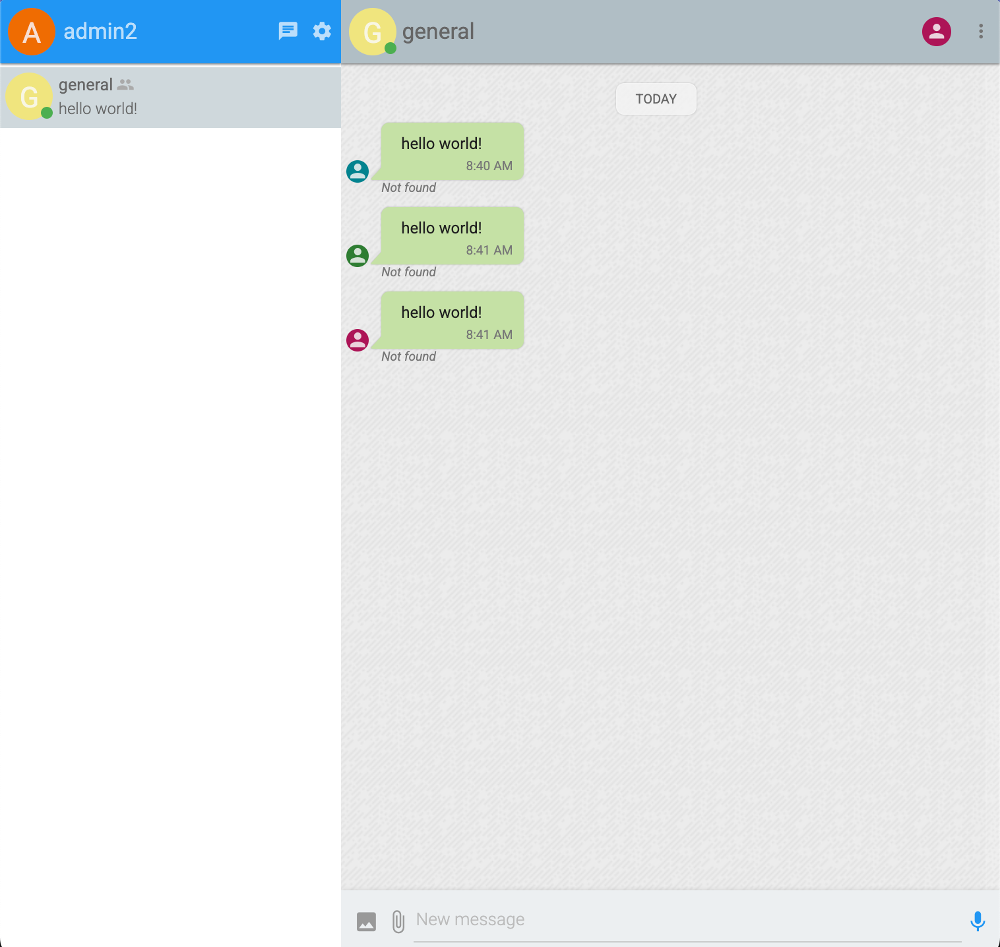
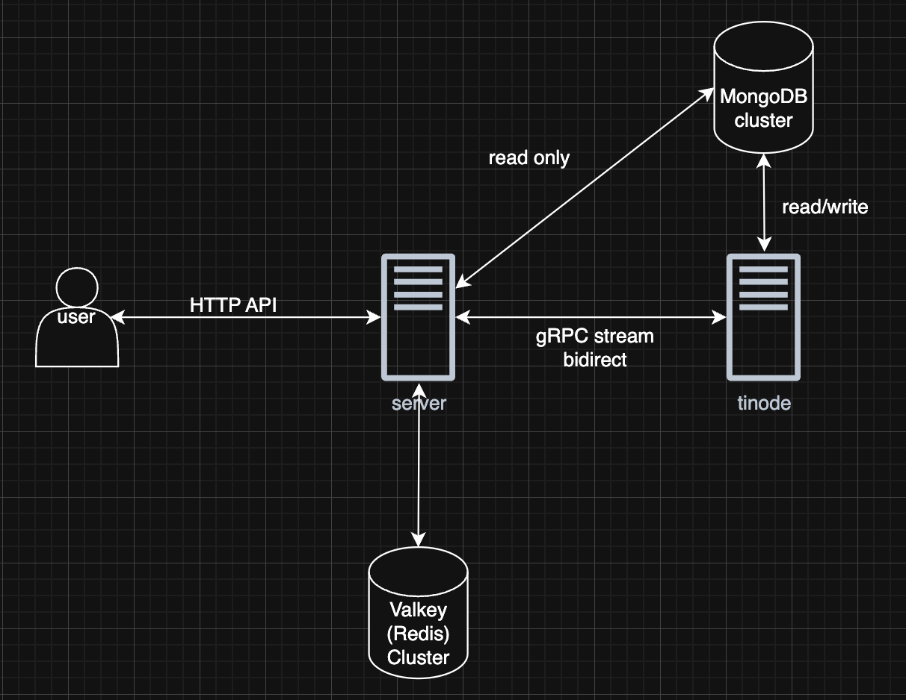
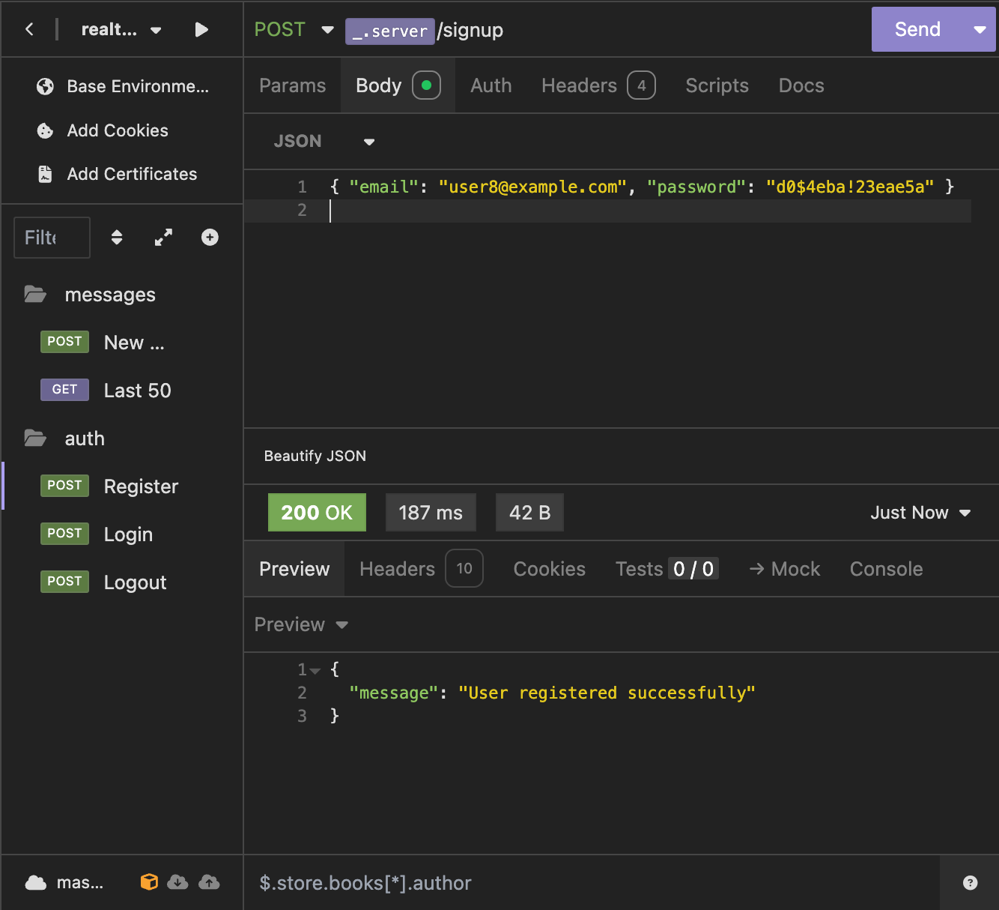
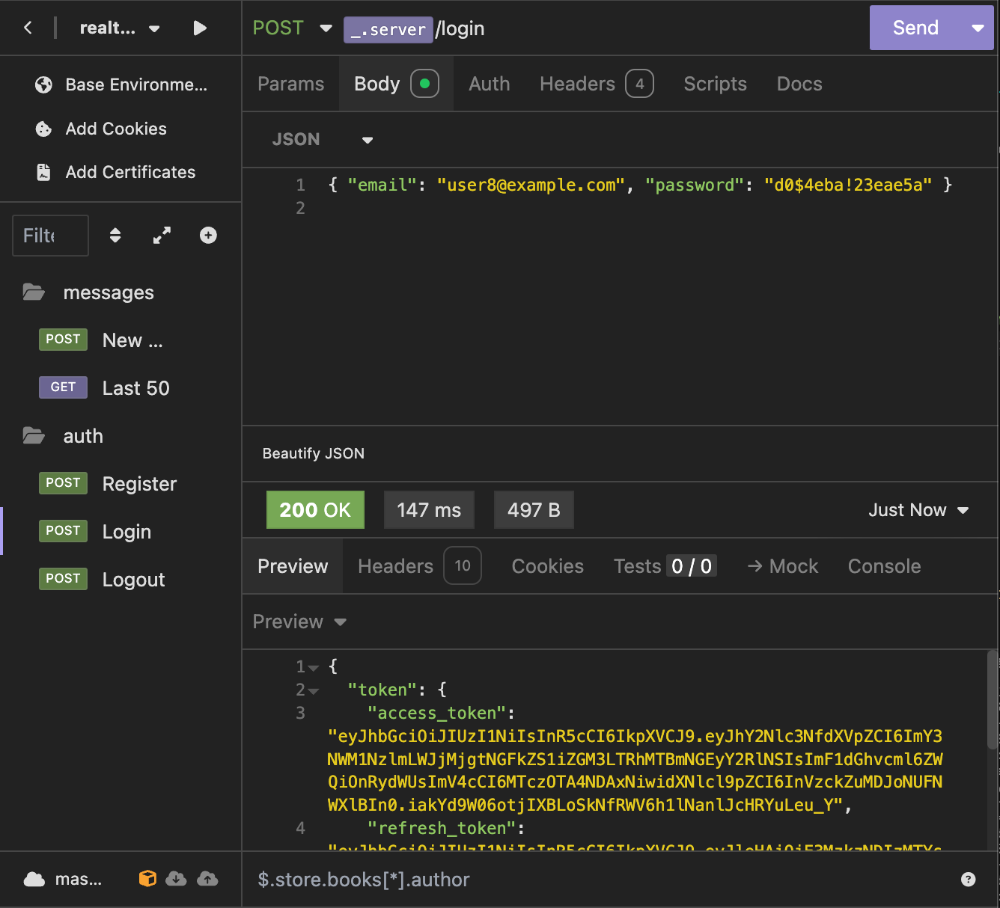
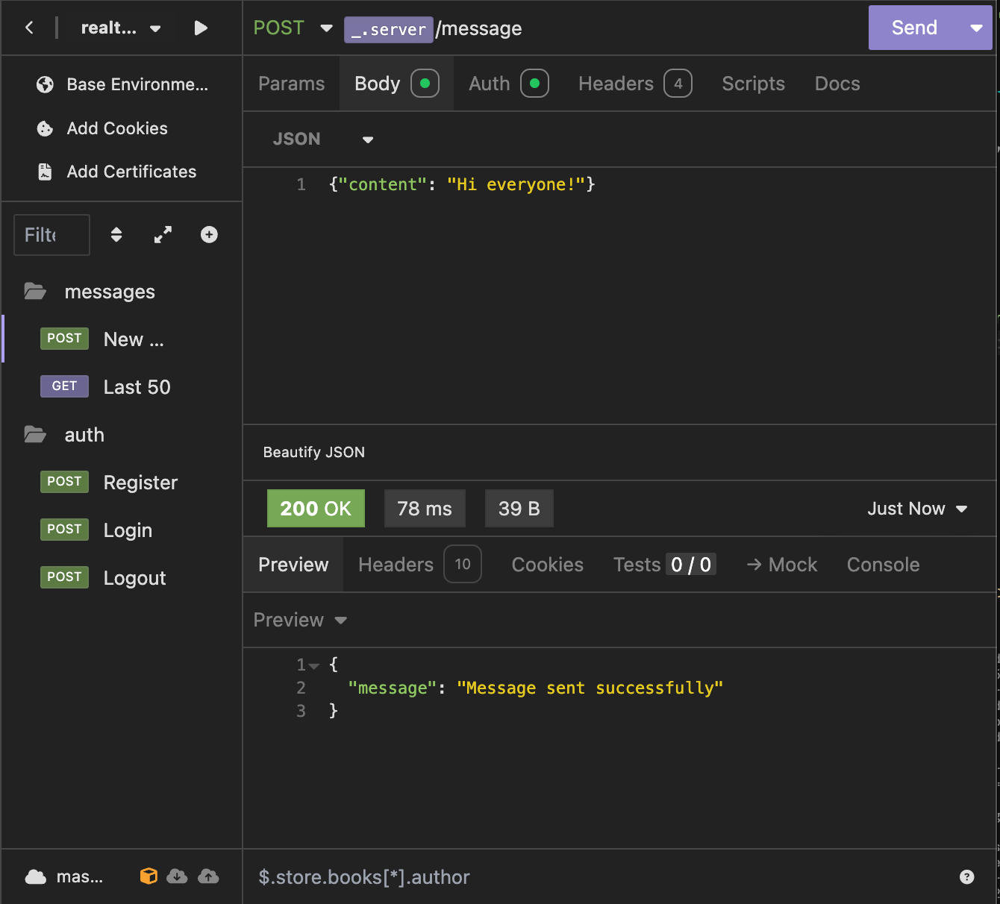
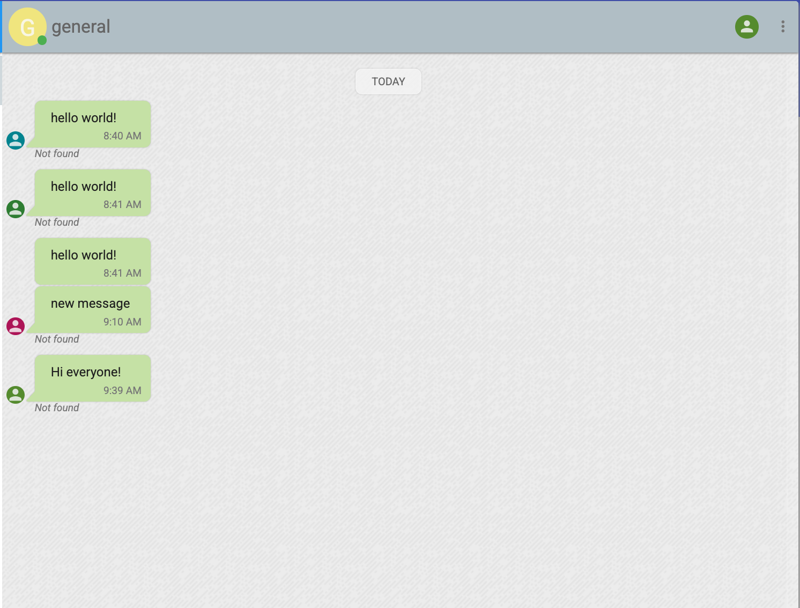
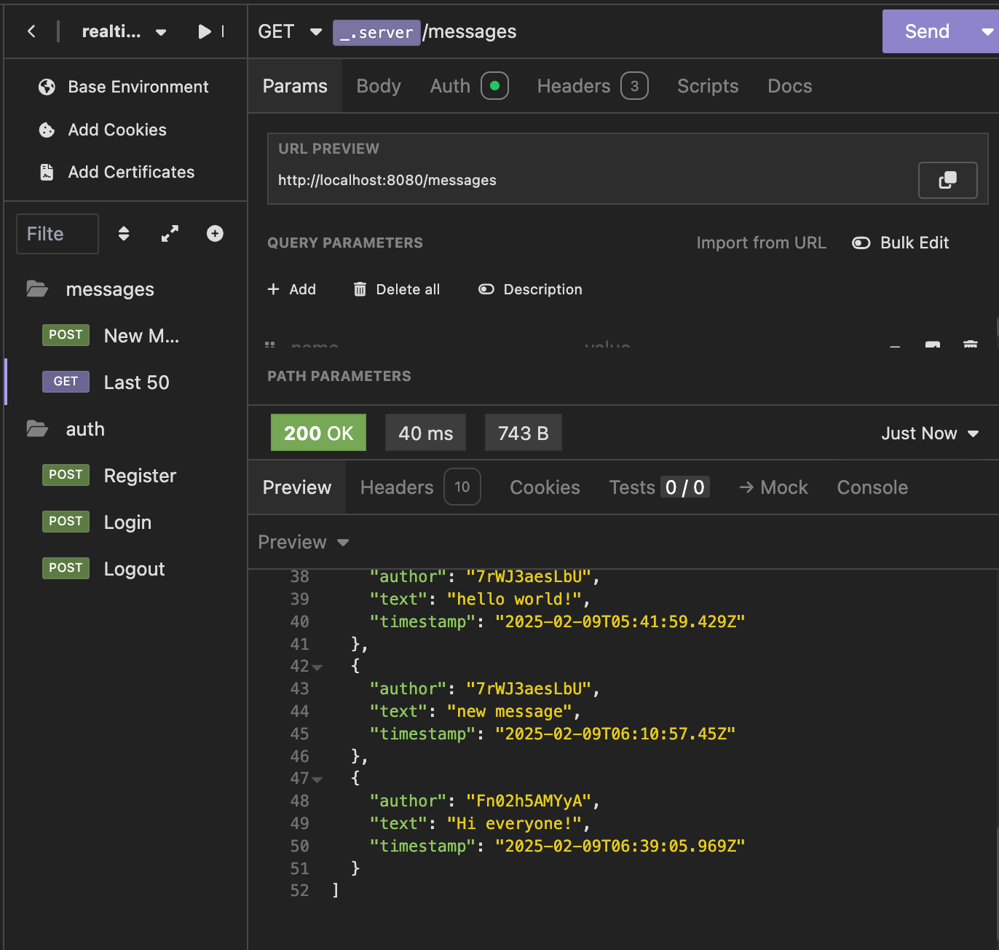

# Real-Time Chat Backend with Go and Tinode

- [Real-Time Chat Backend with Go and Tinode](#real-time-chat-backend-with-go-and-tinode)
  - [Overview](#overview)
  - [Demo](#demo)
  - [System Architecture](#system-architecture)
    - [Components](#components)
    - [Authentication Flow](#authentication-flow)
  - [Technical Implementation](#technical-implementation)
    - [Key Challenges Addressed](#key-challenges-addressed)
  - [Setup and Configuration](#setup-and-configuration)
    - [System Components \& Their Roles](#system-components--their-roles)
    - [Setup Process](#setup-process)
    - [Data Flow](#data-flow)
  - [Future Work](#future-work)




## Overview
This project implements a real-time chat backend service using Go programming language and Tinode as the messaging platform. It provides a secure and scalable solution for user authentication and real-time message exchange in a single chat room environment.


Users communicate with the server through a HTTP API. Authorization is done using JWT, which includes a user_id and an access_id. The server communicates with the Valkey cluster, exchanging the access_id for a tinode_token. The server then communicates with the Tinode server using a bidirectional gRPC stream. The server connects to the MongoDB cluster in readonly mode, while the Tinode server has read-write access.


Since Tinode is in its early stages of development, the API is unstable, and there are some bugs, integrating with Tinode was the main challenge. Initially, I thought about implementing an in-house user management service and using Tinode only as an instant messaging platform. However, this approach had limitations due to the lack of mobility in terms of integrations with Tinode (only a non-persistent event loop was available — not an event queue) and other technology-dependent limitations.


Another approach was to build a REST RPC server as a plugin for Tinode and integrate it as an identity provider. However, this way the server would not be able to send messages from the user's account and would not meet the required HTTP API protocol.

After further investigation and system design, I decided to fully utilize Tinode and build my solution around it and its user/message management system. One of the challenges was demultiplexing events along independent listeners (multiple requests to Tinode may occur, and responses would come back as {ctrl} events out of order). This challenge was solved by creating temporary (in-memory) named channels for each request and passing responses from Tinode from the listening goroutine to the actor goroutine via the channel.

Another challenge was the unstable Tinode registration API and the lack of support for email as user names. To solve this, I implemented a consistent username generator, which works like this: john@gmail.com -> john_gm_5d41402a (credentials part + 2 characters of domain + 8 character md5 hashsum suffix)


Another challenge is that Tinode uses authorization per stream, not per request. Therefore, for each new user, a separate gRPC stream needs to be implemented and maintained.

## Demo






## System Architecture

### Components
- **HTTP API Server**: Handles user requests and authentication
- **Tinode Server**: Manages real-time messaging
- **MongoDB Cluster**: Stores user data
- **Valkey Cluster**: Handles token expiration & exchange

### Authentication Flow
1. Users authenticate via HTTP API
2. Server issues JWT containing user_id and access_id
3. Server issues Tinode token for platform access
4. Server stores JWT access_id and token in Valkey cluster
4. Tinode server validates tokens for message operations

## Technical Implementation


### Key Challenges Addressed
1. **Tinode Integration**
   - Unstable API handling
   - Limited integration options
   - Custom event handling implementation

2. **Stream Management**
   - Per-user gRPC stream maintenance
   - Authorization scope management

3. **Event Handling**
   - Implementation of demultiplexer for async events
   - Correlation of requests and responses

## Setup and Configuration

### System Components & Their Roles

1. **Backend Service (Go)**
   - Handles HTTP API requests
   - Manages user authentication
   - Interfaces with Tinode for messaging
   - Written in Go and runs on port 8080

2. **MongoDB Cluster**
   - Consists of Primary (port 27017) and Secondary (port 27018) nodes
   - Runs in replica set mode "rs0"
   - Stores user data and chat history
   - Accessed through mongo-admin interface on port 8081

3. **Tinode Server**
   - Handles real-time messaging infrastructure
   - Runs on ports 16060 (gRPC) and 6060 (HTTP)
   - Uses MongoDB for data persistence
   - Manages chat rooms and message delivery

4. **Valkey Cluster (Redis-compatible)**
   - Primary node on port 6379
   - Secondary (replica) node on port 6380
   - Handles token management and session data
   - Requires password authentication

### Setup Process

1. **Environment Setup**
```bash
cp .env.example .env
# Edit .env to set:
# - ENV (development/production)
# - SSL (true/false)
# - ACCESS_SECRET (JWT signing key)
# - REFRESH_SECRET (JWT refresh token key)
# - REDIS_PASS (Valkey cluster password)
```

2. **Database Initialization**
```bash
# Initialize MongoDB replica set
docker compose up mongo-setup
# This creates a replica set with primary and secondary nodes
```

3. **Launch Tinode Server**
```bash
doker compose up -d tinode
```

4. **Setup Tinode Admin Account and Topic**

Navigate to http://localhost:6060 and create a new admin account. Then, navigate to the topic list and create a new topic called "general". Copy the topic ID (it will look like this: `grpIpFXpGGNaas`) and set it as an environment variable:
```bash
export TINODE_TOPIC_ID=grpIpFXpGGNaas
```

5. **Launch Full Stack**
```bash
docker compose up
# This starts:
# - Backend API server
# - Valkey cluster
# - Mongo-admin interface
```

### Data Flow

1. **User Registration/Login**
   - User sends credentials to backend API
   - Backend generates unique username (email-based)
   - Backend creates user in Tinode (persists in MongoDB)
   - Generated Tinode token to be used for message delivery
   - Returns JWT containing user_id and access_id

2. **Message Flow**
   - User sends message via HTTP API
   - Backend validates JWT
   - Backend exchanges access_id for Tinode token via Valkey
   - Message is sent to Tinode server via gRPC
   - Tinode broadcasts message to all connected clients
   - Message is stored in MongoDB

3. **Authentication Chain**
```
User -> JWT -> Backend -> Valkey -> Tinode Token -> Message Delivery
```

All services are containerized and configured for high availability with health checks and proper dependency management through Docker Compose.

## Future Work

There are several improvements that can be made to this project:
- [ ] Utilize proper golang `context` for cancellation, error handling and timeouts
- [ ] Implement additional authorization service (JSON RPC) to be used for user management within Tinode
- [ ] Adapt distributed messaging platform (like NATS.io, Kafka, etc.) for scalability and performance
- [ ] Create unified config for dependency injection within the application (instead of using environment variables)
- [ ] Use secure secret storage (like Vault) for sensitive data (e.g. JWT signing key, refresh token key, MongoDB password)
- [ ] Kubernetes deployment